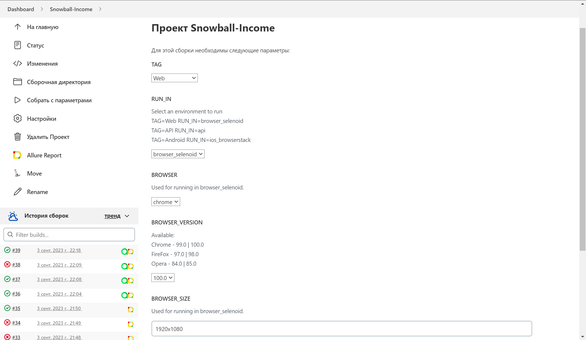
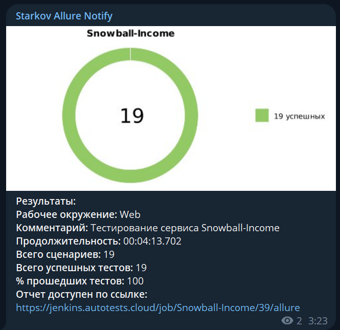
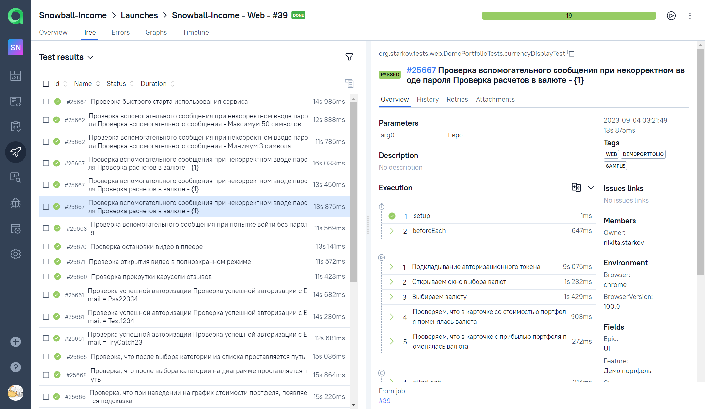

## Проект по автоматизации тестирования для сервиса [Snowball-Income](https://snowball-income.com/)
<p  align="center">
<a href="https://snowball-income.com/"></a> <a href="https://snowball-income.com/"></a>
</p>

### :pushpin: Содержание:

+ [Описание](#Описание)
+ [Используемый стек](#computer-используемый-стек)
+ [Варианты запуска](#Варианты-запуска)
    + [Запуск тестов из терминала](#Команды-для-gradle)
    + [Запуск в Jenkins](#-запуск-в-jenkins)
+ [Уведомления в Telegram](#-telegram-уведомления)
+ [Результаты тестов в Allure Report](#-результаты-тестов-в-allure-report)
+ [Интеграция с Allure TestOps](#-интеграция-с-allure-testops)
+ [Интеграция с Jira](#-интеграция-с-allure-testops)
+ [Видео примера запуска тестов в Selenoid](#-видео-запуска-тестов-в-selenoid)

# <a name="Описание">Описание</a>
Тестовый проект состоит из веб-тестов (UI), тестов API и мобильных тестов (Android).

**Краткий список интересных фактов о проекте:**
- [x] `Page Object` проектирование
- [x] Параметризованные тесты
- [x] Различные конфигурации для запуска теста в зависимости от параметров сборки
- [x] Конфигурация с библиотекой `Owner`
- [x] Написана кастомная аннотация `@WithLogin` для прокидывания токена авторизации
- [x] Использование `Lombok` для моделей в API тестах
- [x] Использование request/response спецификаций для API тестов
- [x] Custom Allure listener для API requests/responses логов
- [x] Автотесты как тестовая документация
- [x] Интеграция с `Allure TestOps`
- [x] Интеграция с `Jira`

### :computer: Используемый стек

<p  align="center">
  <a href="https://www.jetbrains.com/idea/"><code></code>
  <a href="https://www.java.com/"><code></code>
  <a href="https://selenide.org/"><code></code>
  <a href="https://aerokube.com/selenoid/"><code></code>
  <a href="https://gradle.org/"><code></code>
  <a href="https://junit.org/junit5/"><code></code>
  <a href="https://rest-assured.io/"><code></code>
  <a href="http://appium.io/docs/en/2.1/"><code></code>
  <a href="https://www.browserstack.com/"><code></code>
  <a href="https://github.com/allure-framework/allure2"><code></code>
  <a href="https://qameta.io/"><code></code>
  <a href="https://github.com/"><code></code>
  <a href="https://www.jenkins.io/"><code></code>
  <a href="https://www.atlassian.com/ru/software/jira"><code></code>
  <a href="https://web.telegram.org/"><code></code>
</p>

Автотесты в этом проекте написаны на `Java` использую `Selenide` фреймворк.\
`Gradle` - используется как инструмент автоматизации сборки.  \
`JUnit5` - для выполнения тестов.\
`REST Assured` - для тестирования REST-API сервисов.\
`Jenkins` - CI/CD для запуска тестов удаленно.\
`Selenoid` - для удаленного запуска браузера в `Docker` контейнерах.\
`Browserstack` - для запуска мобильных тестов удаленно.\
`Appium` - для взаимодействия с мобильным устройством.\
`Allure Report` - для визуализации результатов тестирования.\
`Telegram Bot` - для уведомлений о результатах тестирования.\
`Allure TestOps` - как система управления тестированием.

[Вернуться к оглавлению ⬆](#pushpin-содержание)

# <a name="Варианты запуска">Варианты запуска</a>

## <a name="GradleCommand">Команды для Gradle</a>
Для запуска локально и в Jenkins используется следующая команда::
```bash
gradle clean test -Dtag=<tag> -DrunIn=<runIn>
```

Дополнительные параметры:
> `-Dselenoid_user_sys_prop=enter_user` `-Dselenoid_key_sys_prop=enter_key` - данные для входа в Selenoid\
> `-Dbrowserstack_user_sys_prop=enter_user` `-Dbrowserstack_key_sys_prop=enter_key` - данные для входа в Browserstack\
> `-Dsnowball_login_sys_prop=enter_login` `-Dsnowball_pass_sys_prop=enter_pass`- данные для авторизации в Snowball-Income.

`tag` - теги для запуска выполнения тестов:
>- *API*
>- *Web*
>- *Mobile*
 
`runIn` - определяет среду для запуска этих тестов:
>- *api* - for api tests
>- *browser_selenoid*
>- *browser_local*
>- *ios_browserstack*

Дополнительные свойства извлекаются из соответствующего файла конфигурации (в зависимости от значения `runIn`):
```bash
./resources/config/${runIn}.properties
```

Допустимые комбинации:


[Вернуться к оглавлению ⬆](#pushpin-содержание)

##  <a name="Запуск в Jenkins">Запуск в [Jenkins](https://jenkins.autotests.cloud/job/Snowball-Income/)</a>
Главная страница сборки:
<p  align="center">

</p>

Параметризованное задание Jenkins может быть запущено с необходимыми ***Browser***, ***Browser Version***, ***Browser Size*** и ***Feature***:
<p  align="center">

</p>

Конфиденциальная информация (имена для входа и пароли) хранится в зашифрованном виде в хранилище учетных данных Jenkins.\
И относительно безопасно передается в сборку аргументами gradle, а его значения маскируются в логах.

После завершения сборки результаты тестирования доступны в:
>- <code><strong>*Allure Report*</strong></code>
>- <code><strong>*Allure TestOps*</strong></code> - результаты загружаются туда и тест-кейсы могут автоматически обновляться в соответствии с последними изменениями в коде.

[Вернуться к оглавлению ⬆](#pushpin-содержание)

#  <a>Telegram уведомления</a>
После завершения сборки, бот созданный в <code>Telegram</code>, автоматически обрабатывает и отправляет сообщение с результатом.
<p  align="center">

</p>

[Вернуться к оглавлению ⬆](#pushpin-содержание)

#  <a name="AllureReport">Результаты тестов в [Allure Report](https://jenkins.autotests.cloud/job/Snowball-Income/39/allure/)</a>

## Главная страница
Главная страница отчета Allure содержит следующие блоки:

>- <code><strong>*ALLURE REPORT*</strong></code> - отображает дату и время теста, общее количество запущенных тестов, а также диаграмму с процентом и количеством успешных, упавших и сломавшихся в процессе выполнения тестов
>- <code><strong>*TREND*</strong></code> - отображает тенденцию выполнения тестов для всех запусков
>- <code><strong>*SUITES*</strong></code> - отображает распределение тестов по сьютам
>- <code><strong>*CATEGORIES*</strong></code> - отображает распределение неудачных тестов по типам дефектов
<p align="center">
  
</p>

## Список тестов с шагами и тестовыми артефактами
На странице список тестов, сгруппированных по наборам, с указанием статуса для каждого теста.\
Может быть показана полная информация о каждом тесте: теги, продолжительность, подробные шаги.

<p align="center">
  
</p>

Также доступны дополнительные тестовые артефакты:
>- Screenshot
>- Page Source
>- Browser console log
>- Video

<p align="left">
  
</p>

[Вернуться к оглавлению ⬆](#pushpin-содержание)

#  <a>Интеграция с [Allure TestOps](https://allure.autotests.cloud/project/3642/dashboards)</a>
> Ссылка доступна только авторизованным пользователям.

Выполнена интеграция сборки <code>Jenkins</code> с <code>Allure TestOps</code>.
Результат выполнения автотестов отображается в <code>Allure TestOps</code>
На Dashboard в <code>Allure TestOps</code> отображена статистика пройденных тестов.

Тест-кейсы в проекте импортируются и постоянно обновляются из кода,
поэтому нет необходимости в синхронизации ручных тест-кейсов и автотестов.\
Достаточно создать и обновить автотест в коде и тест-кейс всегда будет в актуальном состоянии.

## Allure TestOps Dashboard

<p align="center">
  
</p>


## Allure TestOps Test Cases

<p align="center">
  
</p>

[Вернуться к оглавлению ⬆](#pushpin-содержание)

#  <a>Интеграция с [Jira](https://jira.autotests.cloud/browse/HOMEWORK-828)</a>
Реализована интеграция <code>Allure TestOps</code> с <code>Jira</code>, в тикете отображается информация, какие тест-кейсы были написаны в рамках задачи и результат их прогона.
<p align="center">
  
</p>

[Вернуться к оглавлению ⬆](#pushpin-содержание)

#  <a>Видео запуска тестов в Selenoid</a>
К каждому тесту в отчете прилагается видео прохождения теста:
<p align="center">
  
</p>
Видео выполнения на мобильном устройстве:
<p align="center">
  
</p>

[Вернуться к оглавлению ⬆](#pushpin-содержание)
